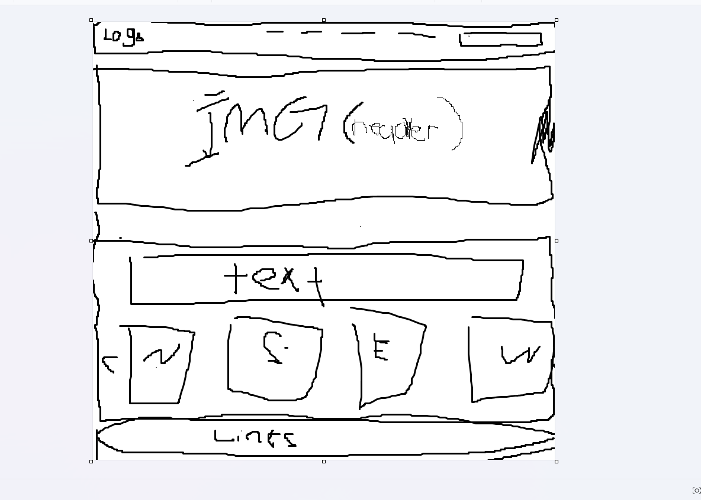

# az-kayak-guide# 

# No license selected

## Description

# This application is designed provide users the ability to come to our application and book a guided tour on one of our beautiful Arizona lakes. The user will have the option to add features such as a rented kayak or fishing on to the tours we provide. This application will also allow users to come and blog about thers different experiences at the lakes around Arizona as well as their experiences with our tours.  

## Table of Contents
1. [Installation](#installation)
2. [Usage](#usage)
3. [Contributors](#contributors)
4. [License](#license)
5. [Tests](#tests)
6. [Questions](#questions)

## WireFrame

## Usage
User can navigate to live deployed link and explore through opur applicatation. 
## Contributors
Jessica Schmidt, Heather Serrano, Zachary Gemmill

## License
This project is licensed under the None License.

## Questions
For questions about this project, please contact https://github.com/jaschmidt22 